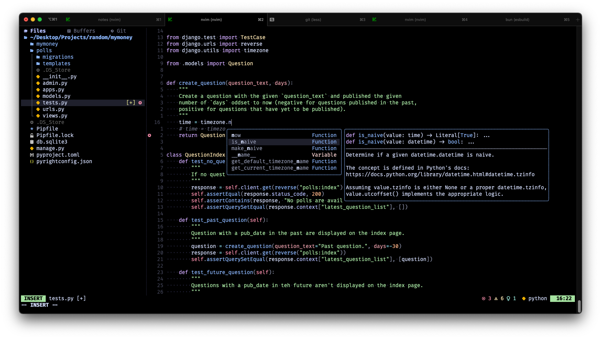
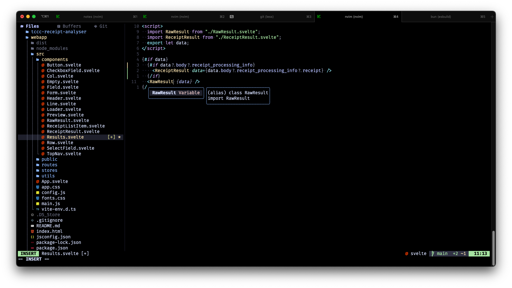
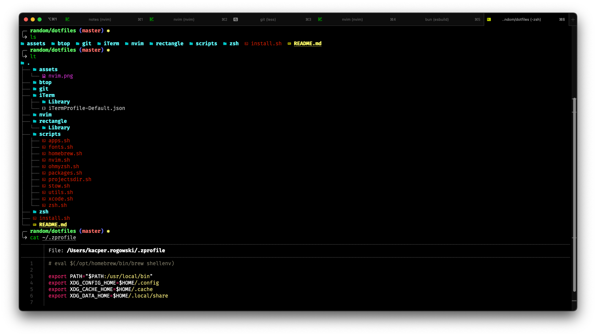
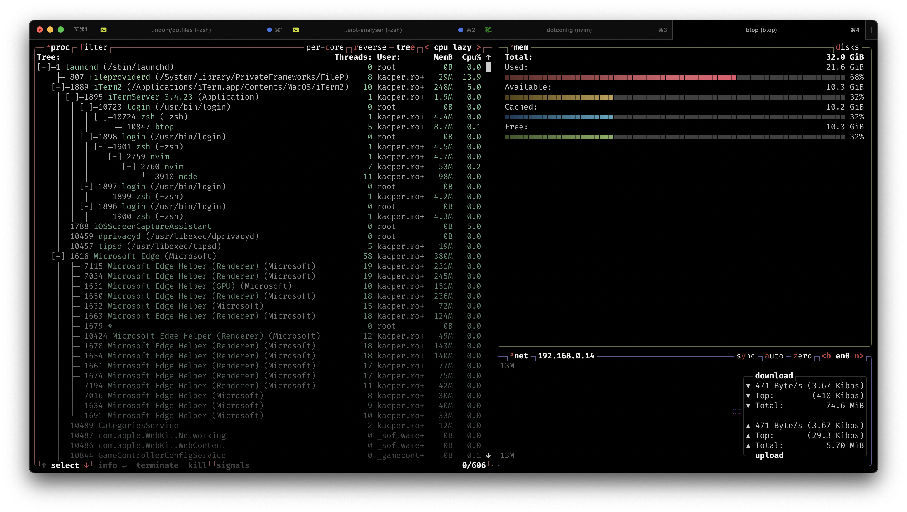
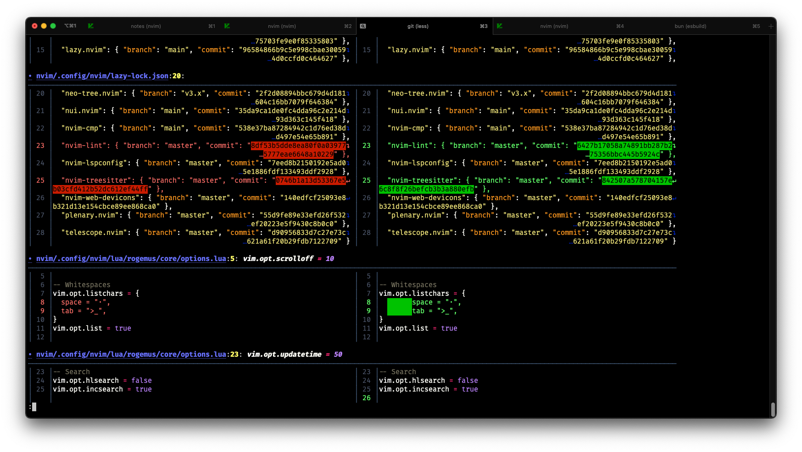

- [NeoVim](#neovim)
  - [Mapping](#mapping)
    - [Package Menagers](#package-menagers)
    - [Comments](#comments)
    - [Vim](#vim)
    - [Navigation](#navigation)
    - [Tabs](#tabs)
    - [Buffers](#buffers)
    - [Split pane](#split-pane)
    - [LSP](#lsp)
    - [Telescope](#telescope)
    - [NeoTree](#neotree)
      - [Misc](#misc)
      - [Navigation](#navigation-1)
      - [Git](#git)
      - [Working with Files and Directories](#working-with-files-and-directories)
      - [Filtering and Searching](#filtering-and-searching)
- [ZSH and iTerm](#zsh-and-iterm)
  - [Mapping](#mapping-1)
  - [Btop](#btop)
- [Git](#git-1)
  - [Diff](#diff)
  - [Mapping](#mapping-2)
  - [Hooks](#hooks)
- [Rectangle](#rectangle)

# NeoVim
| Python | Svelte |
| --- | --- |
|  | 

## Mapping
### Package Menagers
| Keybinding | Action |
| --- | --- |
| :Lazy | Open Lazy.Vim Package menager to download all plugins |
| :Mason | Open Mason Package menager to download all LSP configurations |

### Comments
| Keybinding | Action |
| --- | --- |
| ? (visual mode) | Toggles the region using blockwise comment |

### Vim
| Keybinding | Action |
| --- | --- |
| :q | Close tab (exit vim if only one tab open) |
| :qa | Close all tabs (exit vim) |
| :wq | Close tab and save work (exit vim if only one tab open) |
| :wqa| Clse all tabs and save work (exit vim) | 
| i | Insert mode |
| v | Visual mode |
| V | Visual line mode |
| d | Delete line |
| dd | Delete current line |
| y | Copy (yank) line |
| yy | Copy (yank) current line |
| p | Paste after cursor |
| P | Paste before cursor |
| K | (In Visual mode) Move selected up |
| J | (In Visual mode) Move selected down |
| Ctrl + z | Undo |

### Navigation 
| Keybinding | Action |
| --- | --- |
| h | move the cursor lef |
| j | move the cursor down
| k | move the cursor up
| 10j | Move cursor 10 lines below (10 can be changed to any number |
| 10k | Move cursor 10 lines to top (10 can be changed to any number |
| l | move the cursor right
| b | move to the start of a word
| B | move to the start of a token
| w | move to the start of the next word
| W | move to the start of the next token
| e | move to the end of a word
| E | move to the end of a token
| 0 (zero) | jump to the beginning of the line
| Ctrl + z | Undo |
| $ | jump to the end of the line
| ^ | jump to the first (non-blank) character of the line
| #G / #gg / :# | move to a specified line number (replace # with the line number)

### Tabs
| Keybinding | Action |
| --- | --- |
| Ctrl + ! | Go to tab 1 |
| Ctrl + @ | Go to tab 2 |
| Ctrl + # | Go to tab 3 |
| Ctrl + $ | Go to tab 4 |
| Ctrl + % | Go to tab 5 |
| Ctrl + ^ | Go to tab 6 |
| Ctrl + & | Go to tab 7 |
| Ctrl + * | Go to tab 8 |
| Ctrl + ( | Go to tab 9 |
| Ctrl + ) | Go to tab 10 |
| ]t | Go to next tab |
| [t | Go to prev tab |
| ]T | Go to first tab |
| ]T | Go to last tab |

### Buffers
| Keybinding | Action |
| --- | --- |
| ]b | Go to next buffer |
| [b | Go to prev buffer |
| ]B | Go to first buffer |
| [B | Go to last buffer |

### Split pane
| Keybinding | Action |
| --- | --- |
| Ctrl + w | Focus on next pane |
| Ctrl + h | Focus on next pane to left |
| Ctrl + j | Focus on next pane to bottom |
| Ctrl + k | Focus on next pane to top |
| Ctrl + l | Focus on next pane to right |

### LSP 
| Keybinding | Action |
| --- | --- |
| Enter | Select autocompletion |
| Ctrl + Space | Toggle autocomplete dropdown |
| <leader>gd | Jumps to the definition of the type of the symbol under the cursor. |
| <leader>gD | Jumps to the definition of the symbol under the cursor | 
| K | Displays hover information about the symbol under the cursor in a floating window |
| <leader>vd | Show diagnostics in a floating window |
| [d | Move to the previous diagnostic in the current buffer. |
| ]d | Move to the next diagnostic |
| Ctrl + f | Format document |

### Telescope
| Keybinding | Action |
| --- | --- |
| <leader>fo | Open Files |
| <leader>fr | Recent Files |
| <leader>ff | Find File |
| <leader>fs | Grep in files (Find in files) |
| <leader>gs | Find in  changed git files |

### NeoTree
#### Misc
| Keybinding | Action |
| --- | --- |
| <leader>tt | Toggle sidepanel | 
| < | Prev source |
| > | Next source |
| ? | Help |
| O | Open file in finder/directory |

#### Navigation
| Keybinding | Action |
| --- | --- | 
| j | Move the cursor down to the next entry |
| k | Move the cursor up to the previous entry |
| o | Open the selected file or directory | 

#### Git
| Keybinding | Action |
| --- | --- |
| gc | Git Commit files |
| ga | Git Add selected file |
| A | Git Add all files |
| gP | Git Push |
| gch | Git checkout |
| gcH | Git checkout and create branch |
| gb | List branchs |
| gf | Git fetch |
| gp | Git pull |
| gh | Get Github Link to file/directory | 
| gH | Open file/directory in GitHub |

#### Working with Files and Directories
| Keybinding | Action |
| --- | --- |
| m | Open the Nvim Tree context menu to perform actions on the selected entry |
| d | Delete the selected file or directory (moves it to the trash) |
| y | Copy the path of the selected file or directory to the clipboard |
| r | Rename the selected file or directory | 
| a | Create a new file or directory in the current directory |
| . | Select current directory as root in the tree |

#### Filtering and Searching
| Keybinding | Action |
| --- | --- |
| /{search term} | Start a search to filter files and directories |
| n | Move to the next search result |
| N | Move to the previous search result | 

# ZSH and iTerm

## Mapping
| Keybinding | Action |
| --- | --- |
| got | `git` |
| gut | `git` |
| g | `git` |
| gp | `git pull` |
| gpp | `git push` |
| gch | `git checkout` |
| gc | `git commit -am` |
| ga | `git add .` |
| gm | `git merge` |
| gs | `git status` |
| gd | `git diff` |
| gl | `git lg` |
| glean | `git branch | grep -v "master" | xargs git branch -D` |
| dockerdie | `docker system prune --volumes -a -f` |
| c | `clear` |
| ls | better `ls` | 
| ll | long 'ls |
| lt | simple ls with tree (level 2) |
| dotconfig | Navigate to ~/Desktop/random/dotconfig and open nvim |
| btop | better htop |

## Btop

# Git
## Diff
Git diff using delta

## Mapping
| Keybinding | Action |
| --- | --- |
| git s | `git status` |
| git ch | `git checkout` |
| git ci | `git commit -am` |
| git a | `git add .` |
| git m | `git merge` |
| git d | `git diff` |
| git p | `git pull` |
| git pp | `git push` |
| git lg | `git lg` |
| git f | `git fetch` |

## Hooks
1. `prepare-commit-msg` - add branch name to commit

# Rectangle

