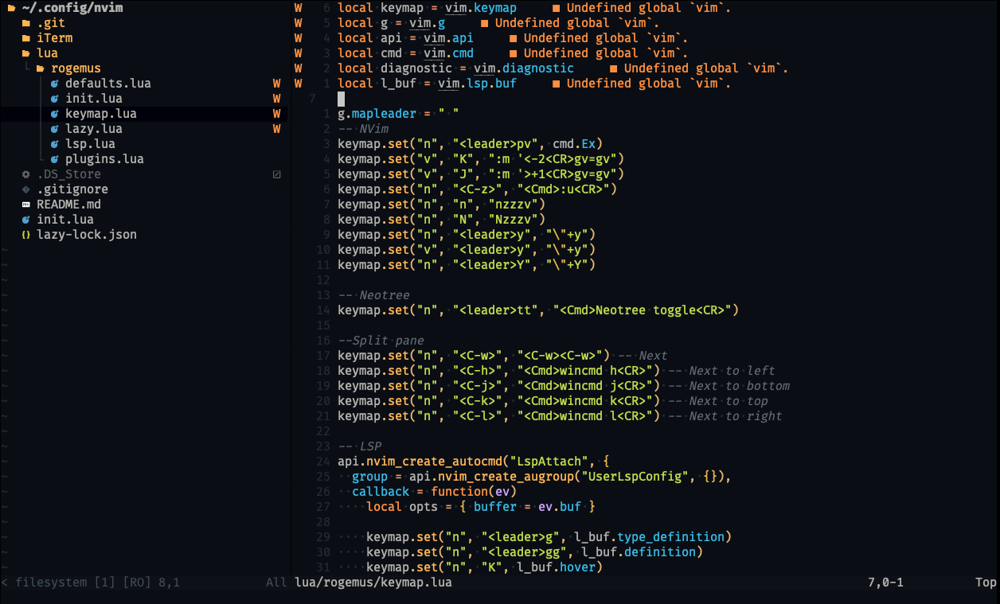

Kicking off my journey to simplify personal development with Neovim. This initial setup is a stepping stone, with future plans to trim down plugins for a sleek and efficient configuration.
Embracing Neovim as a replacement for VS Code, focusing on simplicity without replication.



# Prerequisite
## Terminal
- [iTerm](https://iterm2.com/)
- [FiraCode Font](https://www.nerdfonts.com/font-downloads)
- [iTerm - Profile](./iTerm/iTermProfile-Default.json)

## Install deps
```
brew install nvim ripgrep
```

# Mapping
## Package Menagers
| Keybinding | Action |
| --- | --- |
| :Lazy | Open Lazy.Vim Package menager to download all plugins |
| :Mason | Open Mason Package menager to download all LSP configurations |

## Comments
| Keybinding | Action |
| gc | Toggles the region using linewise comment |
| gb | Toggles the region using blockwise comment |
| gcc | Toggles the current line using linewise comment |
| gbc | Toggles the current line using blockwise comment |

## Vim
| Keybinding | Action |
| --- | --- |
| :q | Close tab (exit vim if only one tab open) |
| :qa | Close all tabs (exit vim) |
| :wq | Close tab and save work (exit vim if only one tab open) |
| :wqa| Clse all tabs and save work (exit vim) | 
| i | Insert mode |
| v | Visual mode |
| V | Visual line mode |
| d | Delete line |
| dd | Delete current line |
| y | Copy (yank) line |
| yy | Copy (yank) current line |
| p | Paste after cursor |
| P | Paste before cursor |
| K | (In Visual mode) Move selected up |
| J | (In Visual mode) Move selected down |
| Ctrl + z | Undo |

### Navigation 
| Keybinding | Action |
| --- | --- |
| h | move the cursor lef |
| j | move the cursor down
| k | move the cursor up
| 10j | Move cursor 10 lines below (10 can be changed to any number |
| 10k | Move cursor 10 lines to top (10 can be changed to any number |
| l | move the cursor right
| b | move to the start of a word
| B | move to the start of a token
| w | move to the start of the next word
| W | move to the start of the next token
| e | move to the end of a word
| E | move to the end of a token
| 0 (zero) | jump to the beginning of the line
| $ | jump to the end of the line
| ^ | jump to the first (non-blank) character of the line
| #G / #gg / :# | move to a specified line number (replace # with the line number)

## Split pane
| Keybinding | Action |
| --- | --- |
| Ctrl + w | Focus on next pane |
| Ctrl + h | Focus on next pane to left |
| Ctrl + j | Focus on next pane to bottom |
| Ctrl + k | Focus on next pane to top |
| Ctrl + l | Focus on next pane to right |

## LSP 
| Keybinding | Action |
| --- | --- |
| Enter | Select autocompletion |
| Ctrl + Space | Toggle autocomplete dropdown |
| <leader>g | Jumps to the definition of the type of the symbol under the cursor. |
| <leader>gg | Jumps to the definition of the symbol under the cursor | 
| K | Displays hover information about the symbol under the cursor in a floating window |
| <leader>vd | Show diagnostics in a floating window |
| [d | Move to the previous diagnostic in the current buffer. |
| ]d | Move to the next diagnostic |
| Ctrl + f | Format document |

## Telescope
| Keybinding | Action |
| --- | --- |
| <leader>ff | Find File |
| <leader>fs | Grep in files (Find in files) |
| <leader>gs | Find in  changed git files |

## NeoTree
### Misc
| Keybinding | Action |
| --- | --- |
| <leader>tt | Toggle sidepanel | 

### Navigation
| Keybinding | Action |
| --- | --- | 
| j	| Move the cursor down to the next entry |
| k | Move the cursor up to the previous entry |
| o	| Open the selected file or directory | 

### Working with Files and Directories

| Keybinding | Action |
| --- | --- |
| m | Open the Nvim Tree context menu to perform actions on the selected entry |
| d	| Delete the selected file or directory (moves it to the trash) |
| y	| Copy the path of the selected file or directory to the clipboard |
| r | Rename the selected file or directory | 
| a | Create a new file or directory in the current directory |
| . | Select current directory as root in the tree |


### Filtering and Searching

| Keybinding | Action |
| --- | --- |
| /{search term} | Start a search to filter files and directories |
| n | Move to the next search result |
| N | Move to the previous search result | 
